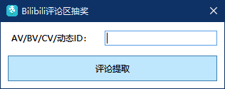
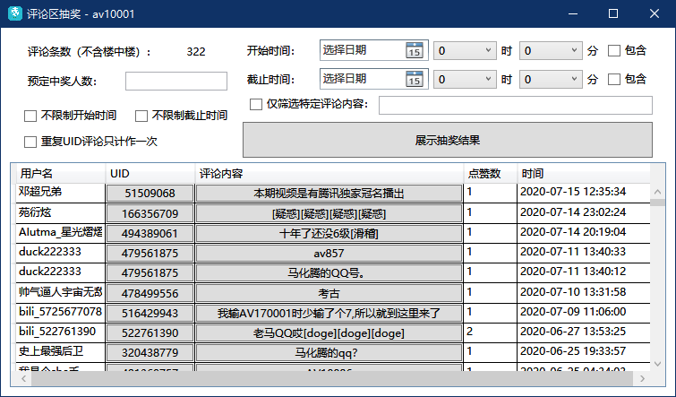
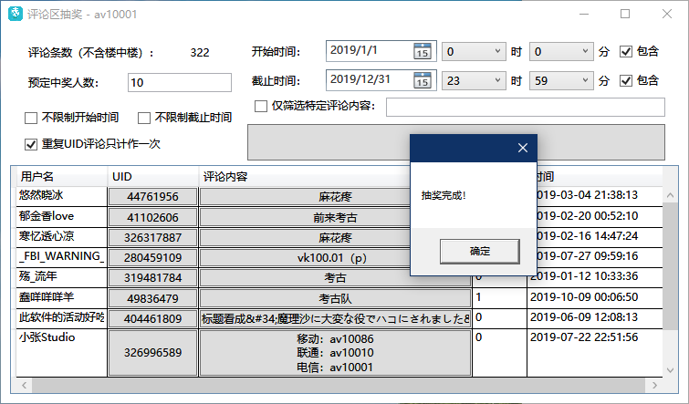

# BiliCommentLottery

> Bilibili评论区抽奖工具

## 功能

- [x] 支持视频稿件AV号/BV号
- [x] 支持专栏稿件CV号
- [x] 支持普通动态号
- [x] 根据开始时间、截止时间筛选评论列表
- [x] 根据评论内容筛选评论列表
- [x] UID重复的评论可只计一次
- [x] 可复制评论网址方便访问
- [ ] 楼中楼评论（可能导致对Bilibili服务器大量访问，舍弃）

## 获取

[X86 & X64](https://github.com/InJeCTrL/BiliCommentLottery/releases/download/1.0/BiliCommentLottery.rar)

## 界面展示

1. 开始界面

2. 抽奖设定

3. 抽奖完成

## 运行需要

[Desktop Runtime 3.1(including DotNet Core Runtime 3.1)](https://dotnet.microsoft.com/download/dotnet-core/3.1)

快速下载Desktop Runtime 3.1.6：

[X86](https://dotnet.microsoft.com/download/dotnet-core/thank-you/runtime-desktop-3.1.6-windows-x86-installer)

[X64](https://dotnet.microsoft.com/download/dotnet-core/thank-you/runtime-desktop-3.1.6-windows-x64-installer)